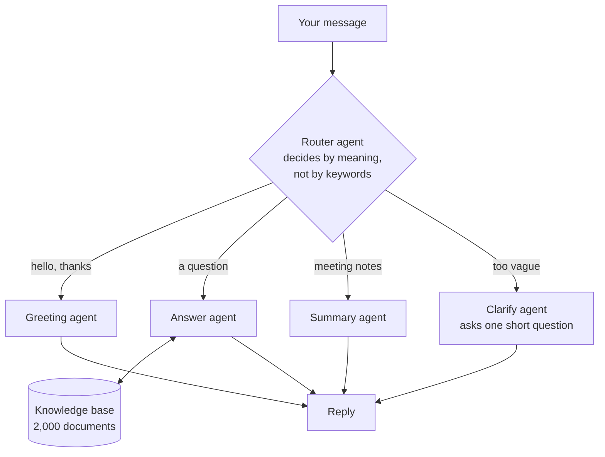
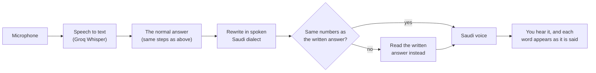

# T2 Assistant

An AI assistant for the employees of T2. You ask it a question about company
policy - by typing or by speaking - and it answers from the company's own
documents, tells you which documents it used, and says "I don't know" when the
documents do not contain the answer. It works in Arabic and English, and it can
also summarise meeting notes.

> **Read this first.** This is a working prototype, not a finished product.
> The policy documents in this repository are **generated sample data, not real
> T2 policies**. Everything else (search, agents, web pages, voice) is real and
> runs on your own computer.

## Contents

- [What it can do](#what-it-can-do)
- [How it works](#how-it-works)
- [Run it on your computer](#run-it-on-your-computer)
- [Using it](#using-it)
- [Voice mode](#voice-mode)
- [Tracing: seeing how an answer was made](#tracing-seeing-how-an-answer-was-made)
- [Settings](#settings)
- [The knowledge base](#the-knowledge-base)
- [How well it works](#how-well-it-works)
- [Tests and code checks](#tests-and-code-checks)
- [Project layout](#project-layout)
- [The HTTP API](#the-http-api)
- [Known limits](#known-limits)
- [Technology used, and why](#technology-used-and-why)

## What it can do

| Feature | What it means |
|---|---|
| Answers policy questions | "How many annual leave days do I get?" is answered in 2-4 sentences, from the documents only. |
| Shows its sources | Every answer lists the document codes it used (for example `HR-0006`). The chat page shows the exact passage and highlights the sentence that supports the answer. |
| Says "I don't know" | If the documents do not cover the question, it declines instead of inventing an answer. |
| Arabic and English | It replies in the language of the question. The documents exist in both languages. |
| Remembers the conversation | A follow-up such as "and for part-time staff?" is understood from the earlier messages. |
| Asks when a question is unclear | If a word could mean two different policies, it asks which one you mean. |
| Summarises meeting notes | Paste notes and get a short summary and a list of action items. |
| **Voice mode** | Ask out loud and hear the answer in a Saudi voice, with the words appearing on screen as they are spoken. |
| Accounts | Each person signs in and sees only their own conversations and folders. |
| Feedback and traces | 👍 / 👎 on each answer, and a link to a full trace of how the answer was produced. |

## How it works

### The big picture

The assistant is a small **team of agents**. One agent (the router) reads your
message and decides which specialist should handle it.



### How a policy question is answered

This is the most important part, because it is what keeps the answers honest.
The answer agent (`src/t2_assistant/agents/answer.py`) does this:

1. **Fixes typing mistakes** in your message.
2. **Makes the question complete.** In a conversation, "and for part-time
   staff?" is rewritten as a full question so the search understands it.
3. **Searches the knowledge base** for the 5 documents closest in *meaning* to
   the question (not just matching words). Old, replaced versions of a policy
   are left out.
4. **Writes the answer using only those passages**, and lists the document
   codes it used. If the passages do not contain the answer, it says so.
5. **Tries once more** with a better search query if the first attempt found
   nothing.
6. **Double-checks before saying "I don't know"**: one last careful look at
   everything it found, because a wrong "I don't know" is also a failure.

The language model is never allowed to answer a policy question from its own
general knowledge.

### What happens to a spoken question



Voice mode does not have its own way of finding answers. It wraps the normal
answer with three extra steps, described in [Voice mode](#voice-mode).

## Run it on your computer

### What you need

- **Python 3.12** or newer.
- A **Groq API key**. It is free: create one at <https://console.groq.com> →
  *API Keys*.
- An **internet connection** (the language model, speech recognition and the
  voice are online services).
- About **1.5 GB of free disk space**. The first run downloads a search model
  of about 1.1 GB.
- For voice mode: **Chrome or Edge**, and a microphone.

The project was developed and tested on Windows 10. The commands below are for
Windows; on macOS or Linux use `.venv/bin/` instead of `.venv\Scripts\` and
`cp` instead of `copy`.

### Steps

Run every command from the project folder.

**1. Get the code and create a private Python environment**

```bash
git clone https://github.com/saifjamal365-cmd/T2_assistant-.git
cd T2_assistant-
python -m venv .venv
.venv\Scripts\activate
```

**2. Install the libraries**

```bash
pip install -e ".[dev]" --only-binary=:all:
```

(`--only-binary=:all:` is needed on Windows for the `chromadb` library.)

**3. Add your Groq key**

```bash
copy .env.example .env
```

Open `.env` in a text editor and put your key after `GROQ_API_KEY=`. This file
stays on your computer; git ignores it.

**4. Build the search index** (once, and again whenever the documents change)

```bash
python -m t2_assistant.knowledge.build_index
```

This reads the 2,000 documents and prepares them for search. The first time, it
also downloads the search model. It runs on your processor and prints its
progress; let it finish.

**5. Start the assistant**

```bash
python -m t2_assistant
```

Open <http://127.0.0.1:8000> in your browser.

**6. (Optional) See the traces**

In a second terminal, from the same folder:

```bash
mlflow ui --backend-store-uri sqlite:///mlflow.db
```

Then open <http://127.0.0.1:5000>. Every question appears there with each step
the agents took.

## Using it

### Signing in

The first screen asks for an email and a password.

- The email must end in **`@t2.sa`**. To try the project, any such address
  works, for example `you@t2.sa`.
- The **first time** an email is used, the account is created with the password
  you type (at least 8 characters). After that, the same password is required.
- Passwords are stored only as a salted hash, never as plain text.

There is no "confirm your email" step, so this sign-in is suitable for a local
prototype only. See [Known limits](#known-limits).

### The chat page (`/`)

- Type a question and press Enter. Try: *"How many annual leave days do I
  get?"*, *"كيف أحجز غرفة اجتماعات؟"*, or paste some meeting notes.
- Under each answer: the **sources** (click one to read the passage, with the
  supporting sentence highlighted), 👍 / 👎, and a **trace** link.
- The sidebar keeps your past conversations. You can rename them, delete them,
  and group them in folders.
- **Model** lets you choose between three Groq models for the answer.
- **Knowledge Base** lets you browse and read the documents themselves.
- **Voice** opens voice mode.
- The sun/moon button switches between light and dark.

## Voice mode

Open <http://127.0.0.1:8000/voice> (or click **Voice** on the chat page) after
signing in.

1. Press the yellow microphone and allow microphone access when the browser
   asks.
2. Ask your question in Arabic.
3. Stop talking. After 2 seconds of silence the recording ends by itself.
4. You hear the answer in a Saudi voice. Each word appears on screen at the
   moment it is spoken.

Under each spoken answer you can open **"الجواب المكتوب والمصادر"** to read the
original written answer and its sources. There is also a text box if you prefer
to type and only listen.

Two switches under the microphone:

| Switch | What it does |
|---|---|
| وقّف التسجيل لحالك إذا سكتّ | On (default): recording stops after 2 seconds of silence. Off: it stops only when you press the button again - useful in a noisy room or if you pause a lot. |
| كمّل تسمعني بعد كل جواب | On: after each answer it starts listening again, so you can keep talking without pressing the button. |

Press the button while it is talking to interrupt it.

### How voice mode stays accurate

The spoken answer is a *rewrite* of the written answer into everyday Saudi
dialect. A rewrite could change a fact by mistake, so it is checked: **if the
spoken version does not contain exactly the same numbers as the written answer,
it is thrown away and the written answer is read instead.** A slightly formal
answer is better than a Saudi-sounding wrong one. Only the written answer is
saved in the conversation.

This check covers numbers only. A changed word that is not a number can still
pass, which is why the written answer is always one click away.

### What to expect for speed

Measured on the development laptop, with the free Groq plan:

- The answer is usually ready **3-7 seconds** after you stop speaking.
- The first sound usually follows in **under 1 second**, but the free voice
  service is uneven and it sometimes takes several seconds.

It is a turn-based conversation (you speak, then it speaks), not a live phone
call.

### The pieces

| Step | Service | Code |
|---|---|---|
| Speech to text | Groq Whisper (same key as the language model) | `voice.transcribe()` |
| Dialect rewrite + number check | Groq language model | `voice.to_spoken()` |
| Text to speech | Microsoft `ar-SA` neural voice, through the `edge-tts` library (no key needed) | `voice.speak()` |

## Tracing: seeing how an answer was made

A *trace* is a recording of one request, step by step: which agent ran, what
was searched, what was sent to the language model, what came back, and how long
each step took. MLflow records it automatically; nothing is logged by hand.
Start the viewer with `mlflow ui --backend-store-uri sqlite:///mlflow.db` and
open the **Traces** tab.

**A typed question** is one trace named `chat`. It contains the router's
decision, every search, and every language-model call, and it is labelled with
the model used, the number of steps the answer needed, and who asked. On the
chat page, the **trace** link under an answer opens it, and a 👍 / 👎 is
attached to it.

**A voice turn** is one trace named `voice_turn`, whether the question was
spoken or typed on the voice page. Every step of the turn is inside it:

| Step in the trace | What it records |
|---|---|
| `speech_to_text` | The size and format of the recording, the model, and the text that was heard. Only for a spoken question. |
| `chat` | The whole answer: the same steps as a typed question (router, searches, model calls). |
| `voice_dialect` | The written answer going in, the spoken text coming out, and whether the rewrite was kept. |
| `text_to_speech` | One per sentence: the sentence, the voice, and the length of the audio produced. |

The top of the trace shows the turn as a whole: what was heard, the written
reply, what was spoken, and how many sentences were read. On the voice page,
the **trace** link under an answer opens it.

**Sound is never stored in a trace** - neither your recording nor the spoken
answer. Only text, sizes and timings are.

Voice traces carry labels you can filter by in the MLflow search box:

| Filter | Finds |
|---|---|
| `tags.channel = 'voice'` | Every voice turn (typed chat has no such label). |
| ``tags.`voice.input` = 'speech'`` | Turns where the question was spoken (`'text'` = typed on the voice page). |
| ``tags.`voice.spoken_from` = 'written'`` | Turns where the accuracy check **refused** the dialect rewrite and the written answer was read instead. The `voice_dialect` step shows the numbers that did not match. |
| ``tags.`voice.interrupted` = 'true'`` | Turns the listener stopped while the answer was still being produced. |

One thing a trace cannot show: what happened on the listener's device. It
records the answer being *produced*, not being *played*, so an answer that was
stopped after all its audio had already been made is not marked as interrupted.

## Settings

All settings live in the `.env` file. Only `GROQ_API_KEY` is required; the rest
have defaults (defined in `src/t2_assistant/config.py`).

| Setting | Default | Meaning |
|---|---|---|
| `GROQ_API_KEY` | - (required) | Your Groq key. |
| `LLM_MODEL` | `openai/gpt-oss-120b` | The Groq model used for routing and answering. |
| `LLM_TEMPERATURE` | `0.2` | Lower = more consistent answers (0-1). |
| `EMBEDDING_MODEL` | `intfloat/multilingual-e5-base` | The local model that turns text into vectors for search. |
| `RETRIEVAL_K` | `5` | How many documents the answer agent reads per search. |
| `MAX_RETRIEVAL_TRIES` | `2` | How many searches it may try before deciding. |
| `CHUNK_SIZE` / `CHUNK_OVERLAP` | `900` / `150` | How documents are split into passages (in characters). Rebuild the index after changing these. |
| `STT_MODEL` | `whisper-large-v3` | Speech-to-text model. `whisper-large-v3-turbo` is faster, slightly less accurate. |
| `STT_LANGUAGE` | `ar` | Language the speaker is expected to use. |
| `TTS_VOICE` | `ar-SA-HamedNeural` | The voice. `ar-SA-ZariyahNeural` is the female voice. |
| `AUTH_EMAIL_DOMAIN` | `t2.sa` | Only emails ending in this domain may sign in. |
| `AUTH_ALLOWED_TEST_EMAILS` | `[]` | Extra exact addresses allowed to sign in, as a JSON list. |
| `SESSION_TTL_DAYS` | `30` | How long a sign-in lasts. |
| `MLFLOW_TRACKING_URI` | `sqlite:///mlflow.db` | Where traces are stored. |
| `MLFLOW_UI_URL` | `http://localhost:5000` | Where `mlflow ui` runs, used to build trace links. |

## The knowledge base

`data/knowledge_base/` holds the documents the assistant answers from.

**They are not real.** They are generated by `scripts/generate_kb.py` to give
the search a realistic amount and variety of material. When real documents are
available they replace these, with no change to the code.

What is in it (counted from `manifest.csv`):

- **2,000 documents**: 1,001 English and 999 Arabic.
- **8 departments**: Human Resources, Information Technology, Finance,
  Facilities, Legal & Compliance, Operations, Marketing & Communications,
  Procurement.
- **114 topics**, each written as up to 4 document types: Policy, Procedure,
  FAQ, Quick Reference.
- **Office variants**: besides the Head Office version, some policies have
  versions for Riyadh, Jeddah, Dubai, Cairo and remote teams, with different
  numbers.
- **Old versions**: 125 documents are marked *Superseded* and point to the
  current version. Search ignores them, so answers come from the live policy.

Every document starts with a header: document code, department, type, version,
effective date, status, owner, who it applies to, and related documents.

Two things worth knowing:

- `manifest.csv` is the list that counts. Only documents listed there are
  indexed. The `en/` and `ar/` folders also contain about 300 older files from
  an earlier generation that are not in the manifest and are not used.
- By default, search uses the general (Head Office) version of a policy. The
  office variants are in the knowledge base, but a normal question is not
  answered from them.

### Rebuild it

```bash
python scripts/generate_kb.py                 # the default set
python scripts/generate_kb.py --count 300     # a smaller set for quick tests
python scripts/generate_kb.py --out data/kb2  # write somewhere else
python -m t2_assistant.knowledge.build_index  # always rebuild the index afterwards
```

The generator always produces the same documents (it uses a fixed seed) and
needs only standard Python.

## How well it works

### How it is measured

The test questions are not written by hand. `scripts/build_eval_set.py` builds
them from the same generator that built the documents, so every expected answer
can be traced to a real document. The set contains:

- questions that use the document's own words,
- the same questions reworded,
- questions that **cannot** be answered from the documents (the assistant
  should decline),

split between English and Arabic. `eval/dataset.json` has 708 questions;
`eval/dataset_subset.json` is a fair 50-question sample, because the free Groq
plan cannot run the full set in one day.

```bash
python -m t2_assistant.evaluation.run                                     # the full set
python -m t2_assistant.evaluation.run --dataset eval/dataset_subset.json  # the 50-question sample
python -m t2_assistant.evaluation.run --resume                            # continue a run that was cut short
```

Results are written to `eval/results/` and logged to MLflow as a run named
"evaluation".

### Results so far

| Run | Overall accuracy | Finds the right document | Correct on answerable questions | Declines when it should | Where it is recorded |
|---|---|---|---|---|---|
| 50-question sample | 98% | 100% | 100% | 90.9% (10 of 11) | Project documentation, Section 12 |
| 20-question run | 90% | 88.9% | 88.9% | 100% (2 of 2) | `eval/results/report.md` (the report currently in this repository) |

Read these with care:

- Both runs are small. The full 708-question run has not been completed.
- All questions are about the generated documents, so the numbers say how well
  the *method* works, not how it will do on real T2 policies.
- **Voice mode has no scored evaluation yet.** It was checked with automatic
  tests and a small manual run of 8 spoken questions, in which every answer
  kept the correct facts. Recognition of real voices, accents and noisy rooms
  has not been measured.

## Tests and code checks

```bash
pytest -m "not integration"   # 90 tests, no internet needed, about a minute
pytest -m integration         # 16 more tests that call the real Groq API and the real index
ruff check src tests          # code style
mypy src tests                # type checking (strict)
```

The normal tests replace the language model and the speech services with
fakes, so they check this project's own logic and never spend API quota.
They also use a throwaway database and a throwaway trace store, so running
them never changes your conversations or adds fake traces to `mlflow.db`.

## Project layout

```
T2_assistant-/
├── README.md                              this file
├── T2_Assistant_Project_Documentation.docx  full requirements, design decisions, phase-by-phase log
├── T2_Assistant_Presentation.pptx         slides
├── pyproject.toml                         project description and pinned library versions
├── .env.example                           template for your settings (copy to .env)
├── data/knowledge_base/
│   ├── en/  ar/                           the generated policy documents
│   └── manifest.csv                       one row per document - the list that counts
├── scripts/
│   ├── generate_kb.py                     builds the sample knowledge base
│   ├── build_eval_set.py                  builds eval/dataset.json
│   └── build_eval_subset.py               picks the fair 50-question sample
├── eval/
│   ├── dataset.json  dataset_subset.json  the test questions
│   └── results/                           report.md, report.json, answers.jsonl
├── src/t2_assistant/
│   ├── __main__.py                        starts the server (python -m t2_assistant)
│   ├── api.py                             every HTTP route; serves the two web pages
│   ├── config.py                          settings, loaded from .env
│   ├── auth.py                            sign-in: allowed emails, password hashing
│   ├── store.py                           the database: users, conversations, messages, runs (SQLite)
│   ├── conversation.py                    runs one chat turn, with memory
│   ├── voice.py                           voice mode: speech to text, dialect rewrite, text to speech
│   ├── observability.py  tracing.py       trace links, 👍/👎 feedback, MLflow setup
│   ├── agents/
│   │   ├── router.py                      chooses the specialist
│   │   ├── graph.py                       connects router → specialist (LangGraph)
│   │   ├── answer.py                      searches, then writes a sourced answer
│   │   ├── greeting.py  clarify.py  summarise.py   the other specialists
│   │   ├── llm.py                         the one place that connects to Groq
│   │   └── state.py                       the data passed between agents
│   ├── knowledge/
│   │   ├── build_index.py                 builds the search index from the manifest
│   │   ├── chunking.py                    splits a document into passages
│   │   ├── embeddings.py                  text → vectors (multilingual E5, runs locally)
│   │   ├── vector_store.py                opens the Chroma index
│   │   └── search.py                      question → closest passages
│   ├── evaluation/                        the scoring code behind "How well it works"
│   └── web/
│       ├── index.html                     the chat page (one file, no build step)
│       └── voice.html                     the voice page (one file, no build step)
└── tests/                                 the automatic tests
```

Created on your computer when you run it, and never committed: `.env` (your
key), `chroma/` (the search index), `store.db` (accounts and conversations),
`mlflow.db` (traces).

## The HTTP API

The web pages use this API, and you can use it directly. Interactive
documentation is at <http://127.0.0.1:8000/docs> while the server runs. Every
route except the two pages, `/health` and `/auth/*` needs a signed-in session
(a cookie set by `/auth/login`).

| Route | What it does |
|---|---|
| `GET /` , `GET /voice` | The chat page and the voice page. |
| `GET /health` | `{"status": "ok"}` when the server is up. |
| `POST /auth/login` | Sign in with `email` and `password`; creates the account on first use. |
| `POST /auth/logout` , `GET /auth/me` | Sign out; who is signed in. |
| `POST /chat` | Send `message` (and `conversation_id` to continue a conversation, `model` to pick a model). Returns the reply, the route chosen, the sources and a trace link. |
| `GET /conversations` , `GET /conversations/{id}` | List your conversations; read one with all its messages. |
| `PATCH /conversations/{id}` , `DELETE /conversations/{id}` | Rename; delete. |
| `PUT /conversations/{id}/folder` | Move a conversation into a folder (or `null` to take it out). |
| `GET` / `POST /folders` , `PATCH` / `DELETE /folders/{id}` | Manage folders. Deleting a folder keeps its conversations. |
| `GET /runs` , `GET /runs/{id}` | Past requests, each with its trace link and feedback. |
| `POST /runs/{id}/feedback` | Record 👍 / 👎 (`helpful`, optional `comment`). |
| `GET /kb/documents` , `GET /kb/documents/{doc_id}` | Browse the knowledge base (filter by `department`, `language`, `topic`, or title search `q`); read one document. |
| `POST /voice/turn` | A spoken question. The request body is the recording (`conversation_id` as a query parameter to continue a conversation). The response is a stream of JSON lines: what was heard, then the answer (written `reply` plus `spoken` text), then one line per spoken sentence with its mp3 audio and the time each word starts. |
| `POST /voice/ask` | The same for a typed question (`message`, `conversation_id`); the stream starts with the answer. |

## Known limits

**The data**

- The policy documents are generated samples, not real T2 policies.

**The free services**

- The free Groq plan limits how much you can ask per minute and per day. When
  the limit is hit, an answer can wait 10 seconds or more, and long test runs
  cannot finish in one day.
- The voice comes from `edge-tts`, which uses the free read-aloud service
  behind Microsoft Edge. It needs no key, but it is unofficial and its speed is
  uneven. **Replace it with a licensed service (for example Azure Speech, which
  has the same voices) before any real use.**

**Voice mode**

- It is turn-based, not a live two-way call.
- Speech recognition is fixed to Arabic. A question spoken in English will not
  be understood. Change `STT_LANGUAGE` to use another language.
- The voice has a Saudi accent but reads in a fairly formal style, even when
  the text is in dialect.
- The quality of the dialect has not been reviewed by a native Saudi speaker.
- The microphone works only on `localhost` or over https, in Chrome or Edge.

**Security and deployment**

- Sign-in has no email verification: anyone who can reach the server and types
  an `@t2.sa` address that is not yet registered gets that account.
- It is set up to run on one computer over plain `http`. Putting it on a
  network needs https, a secure session cookie, and a proper sign-in method.
- Accounts, conversations and the search index are local files (SQLite and
  Chroma), suitable for one machine.

## Technology used, and why

| Part | Choice | Why |
|---|---|---|
| Language | Python 3.12 | - |
| Agents | LangGraph | Makes the router → specialist flow explicit and easy to trace. |
| Language model | Groq (`openai/gpt-oss-120b` by default) | Fast, and has a free plan. Each model offered was tested against this project's own questions first (`tests/test_models.py`). |
| Search model | multilingual E5 (base), run locally | Handles Arabic and English, built for search, fast enough without a graphics card. |
| Search index | Chroma, local | No server to set up. |
| Speech to text | Groq Whisper | Same key as the language model; handles Arabic. |
| Text to speech | `edge-tts`, `ar-SA` voices | Free, no key, gives the timing of every word. A prototype choice - see [Known limits](#known-limits). |
| Storage | SQLite | One file, nothing to install. |
| Tracing | MLflow, local | Shows every step of every answer. |
| Web | FastAPI + two plain HTML pages | No front-end build step. |

The reasoning behind each choice, the full requirements, and a log of how the
project was built phase by phase are in
`T2_Assistant_Project_Documentation.docx`.
